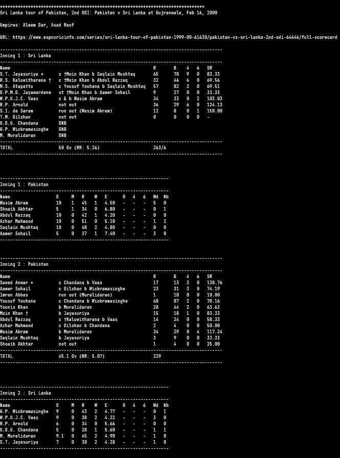

# scorecard-generator

Simple python script to list current live cricket matches and view their scorecards using ESPNCricinfo.

Also can view any scorecard on Cricinfo if its match id is known.

### Example Scorecard:

