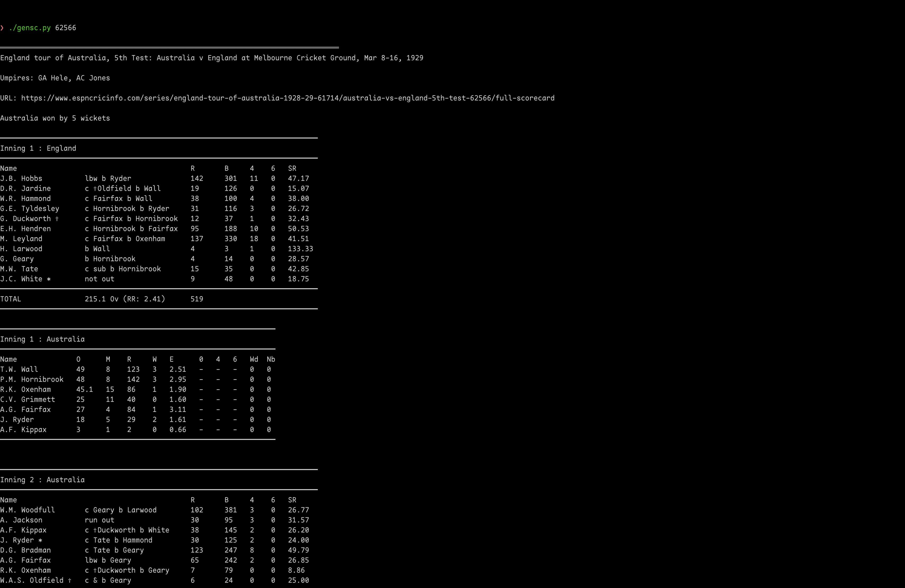
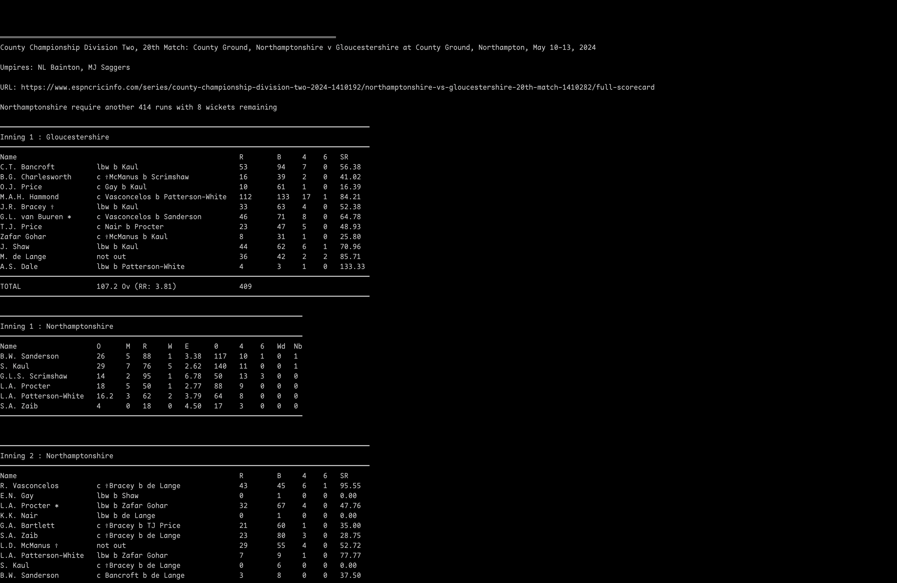

# scorecard-generator

Simple python script to list current live cricket matches and view their scorecards using ESPNCricinfo.

Also can view any scorecard on Cricinfo if its match id is known.

### Libraries Required:
- [`beautifulsoup4`](https://pypi.org/project/beautifulsoup4/)
- [`feedparser`](https://pypi.org/project/feedparser/)
- [`pandas`](https://pypi.org/project/pandas/)
- [`requests`](https://pypi.org/project/requests/)

### Screenshots:
#### Print scorecard to `stdout`

#### Get current matches and select match to generate scorecard that refreshes every 5 seconds

